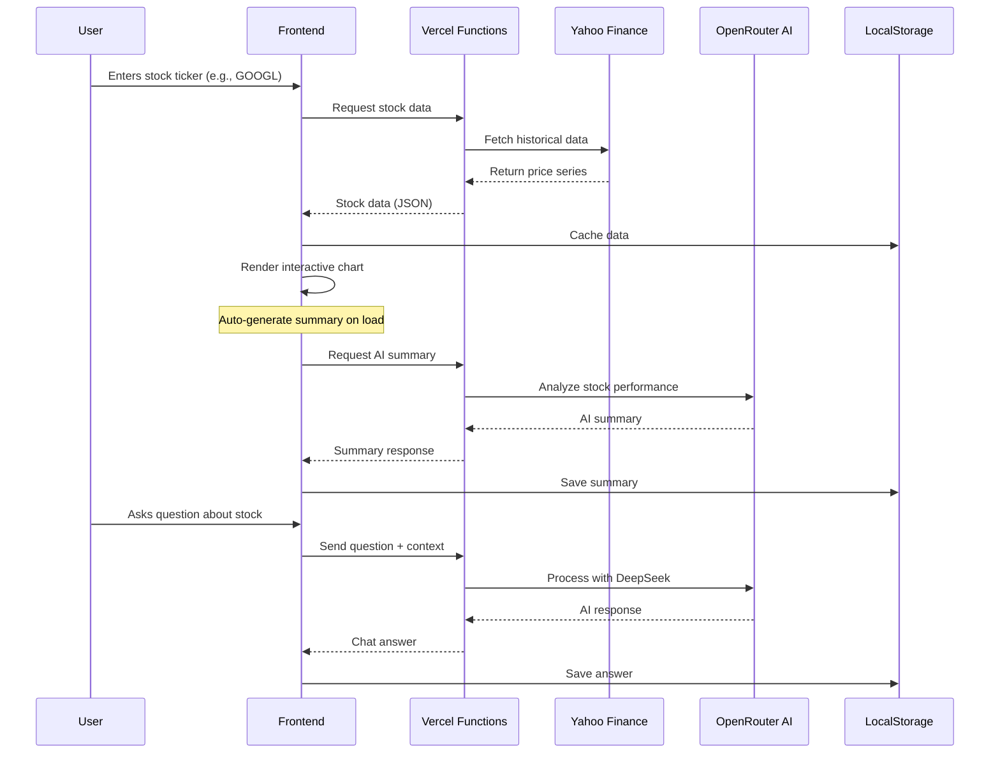

# AI Stock Dashboard

[Link to AI Stock Dashboard](https://wesleys-stock-dashboard.vercel.app/)


A real-time stock market dashboard with AI-powered insights, featuring interactive charts, automated summaries, and conversational analysis. Built with Angular frontend and Node.js backend, designed for scalable deployment on Vercel.

---

## Technology Stack

| Area      | Technology                                                                                             |
| :-------- | :----------------------------------------------------------------------------------------------------- |
| **Backend** | [Node.js](https://nodejs.org/), [Express](https://expressjs.com/), [Yahoo Finance API](https://github.com/gadicc/node-yahoo-finance2) |
| **Frontend**| [Angular 20](https://angular.io/), [TypeScript](https://www.typescriptlang.org/), [ngx-charts](https://swimlane.github.io/ngx-charts/) |
| **AI**      | [OpenRouter](https://openrouter.ai/) (DeepSeek Chat v3) for market analysis and summaries              |
| **Deployment**| [Vercel](https://vercel.com/) for both frontend and serverless backend functions                     |
| **Styling** | Custom CSS with Glass Morphism, Aurora Effects, CSS Animations                                        |
| **Data**    | Real-time stock data from Yahoo Finance, Local Storage for persistent AI responses                    |

---

## Architecture

This project is a monorepo containing both backend and frontend applications with a modern, scalable architecture.

-   **Backend:** A Node.js/Express API deployed as **Vercel Serverless Functions**. It handles stock data fetching from Yahoo Finance and orchestrates AI analysis through OpenRouter.
-   **Frontend:** An Angular application built with standalone components, deployed as a static site to **Vercel**. It provides real-time stock visualization and AI-powered insights.
-   **Data Flow:** Stock data is fetched server-side to protect API keys. AI processing happens on the backend with responses cached locally for performance.
-   **AI Integration:** Market analysis is powered by **DeepSeek Chat v3** via OpenRouter, providing both automated summaries and interactive Q&A.

### Data Flow Architecture



---

## Features

-   **Real-Time Stock Tracking:** Monitor multiple stocks simultaneously with price data
-   **Interactive Charts:** Responsive line charts with multiple time ranges (1 day to all-time)
-   **AI-Powered Summaries:** Automatic performance analysis for each tracked stock
-   **Conversational AI:** Ask questions about stock performance and get instant insights
-   **Persistent Storage:** AI responses cached locally for instant access
-   **Error Handling:** Graceful handling of invalid tickers with user-friendly alerts
-   **Virtual Scrolling:** Efficient rendering of multiple stock panels

---

## API Endpoints

All endpoints are accessed through Vercel Functions.

| Method | Endpoint                       | Description                                                              | Auth Required |
| :----- | :----------------------------- | :----------------------------------------------------------------------- | :------------ |
| `GET`  | `/api/stocks/:symbol`          | Fetches historical stock data for a given symbol                        | No            |
| `POST` | `/api/chat`                    | Processes AI queries about stock data                                   | No            |

### Request/Response Examples

#### Get Stock Data
```bash
GET /api/stocks/GOOGL?range=1mo&interval=1d
```

Response:
```json
[
  {
    "date": 1703980800000,
    "close": 142.57,
    "high": 143.16,
    "low": 141.10
  },
  ...
]
```

#### AI Chat
```bash
POST /api/chat
Content-Type: application/json

{
  "question": "What's the trend for GOOGL?",
  "context": {
    "symbol": "GOOGL",
    "range": "1mo",
    "series": [...]
  },
  "mode": "chat",
  "stockInfo": { "symbol": "GOOGL" }
}
```

Response:
```json
{
  "answer": "GOOGL has shown steady upward momentum over the past month...",
  "model": "deepseek/deepseek-chat-v3-0324:free"
}
```

---

## License

This project is licensed under the MIT License. See the [LICENSE](LICENSE) file for details.